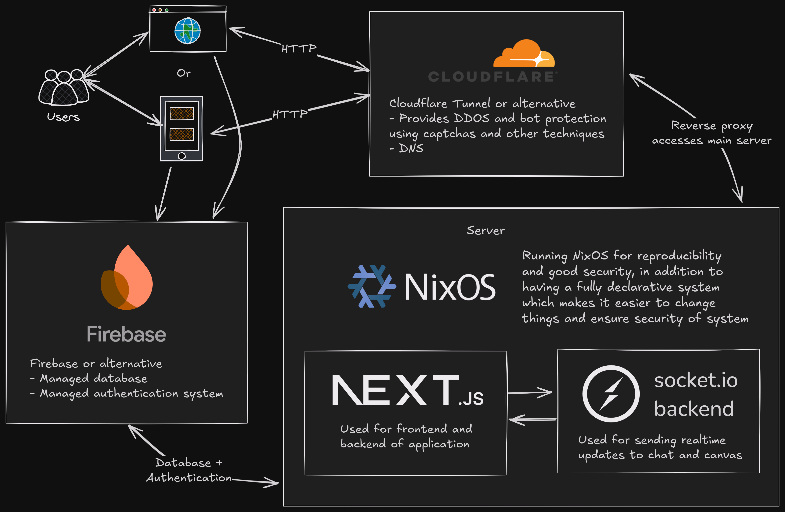

# Space - A Social Media Platform with Pixel Art


Space is an interactive social media platform where users can express themselves through collaborative pixel art (similar to Reddit's r/place) and real-time messaging. The platform enables users to place individual pixels on a shared canvas, creating collaborative artwork while chatting with others.

## Features

- **Interactive Pixel Canvas**: Users can place colored pixels on a shared canvas to create collaborative art
- **Real-time Updates**: All pixel placements and chat messages are synchronized instantly using WebSockets
- **User Authentication**: Firebase authentication system for secure user management
- **Chat System**: Real-time messaging with profanity filtering
- **Responsive Design**: Fully responsive UI built with Next.js and Material UI
- **Inactivity Detection**: Automatic logout after 30 seconds of inactivity for enhanced security

## Tech Stack

### Frontend

- **Next.js 15**: React framework for server-side rendering and routing
- **React 19**: UI component library
- **TypeScript**: Static typing for enhanced code quality
- **Material UI 6**: Component library for consistent design
- **Tailwind CSS**: Utility-first CSS framework
- **Socket.io-client**: Real-time WebSocket communication
- **Firebase Authentication**: User authentication and security

### Backend

- **Node.js**: JavaScript runtime for server-side code
- **Express**: Web framework for API endpoints
- **Socket.io**: WebSocket library for real-time communication
- **Firebase Firestore**: Database for user data
- **bad-words**: Library for chat profanity filtering

### Deployment

- **Hetzner Cloud**: Cloud hosting platform for production deployment

## Getting Started

### Prerequisites

- Node.js (v18 or later)
- npm or yarn
- Firebase account

### Installation

1. Clone the repository:

   ```
   git clone https://github.com/yourusername/canvaspace.git
   cd canvaspace
   ```

2. Install dependencies for the Next.js frontend:

   ```
   cd nextjs
   npm install
   ```

3. Install dependencies for the socket server:

   ```
   cd ../sockets
   npm install
   ```

4. Create your Firebase project and update the Firebase configuration in `/nextjs/src/lib/firebase.ts` with your own credentials.

### Running the Development Environment

1. Start the socket server:

   ```
   cd sockets
   node src/main.js
   ```

2. In a separate terminal, start the Next.js frontend:

   ```
   cd nextjs
   npm run dev
   ```

3. Open your browser and navigate to `http://localhost:3000`

## Architecture



The application is split into two main components:

1. **Next.js Frontend**: Handles the user interface, authentication, and client-side interactions
2. **Socket.io Server**: Manages real-time communication for the pixel canvas and chat system

Data flow:

- Users authenticate through Firebase
- Authenticated users can place pixels and send messages
- WebSockets transmit these actions to all connected clients in real-time
- The server persists the canvas state and chat history to disk at regular intervals

## Skills Developed

This project helped develop and demonstrate the following skills:

- **Full-Stack Development**: End-to-end implementation of a complete web application
- **Real-Time Systems**: WebSocket communication for instant updates across clients
- **User Authentication**: Implementing secure login systems with Firebase
- **State Management**: Handling complex application state with React context
- **Responsive Design**: Creating a UI that works across different device sizes
- **Data Persistence**: Saving and loading application state
- **Security**: Implementing authentication, authorization, and input sanitization
- **UI/UX Design**: Creating an intuitive and engaging user interface
- **Deployment**: Setting up and configuring cloud hosting

## License

This project is licensed under the MIT License - see the LICENSE file for details.
